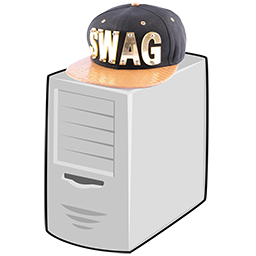
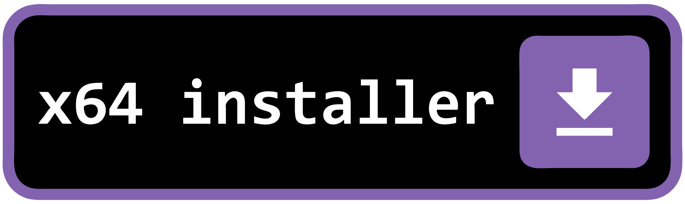
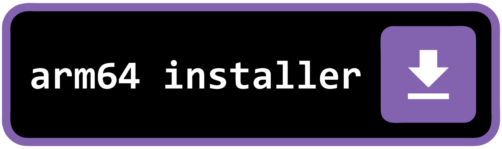
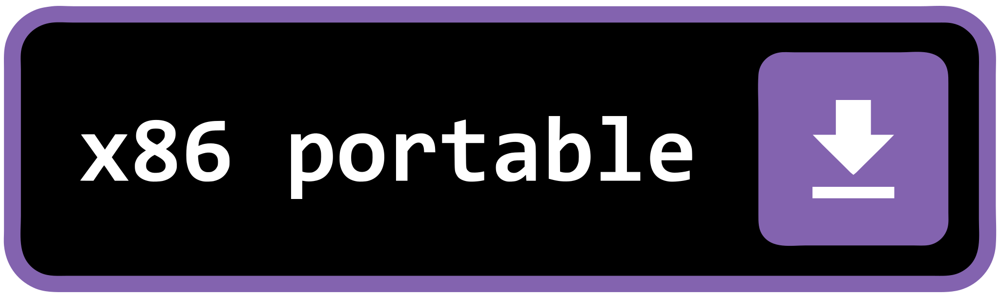
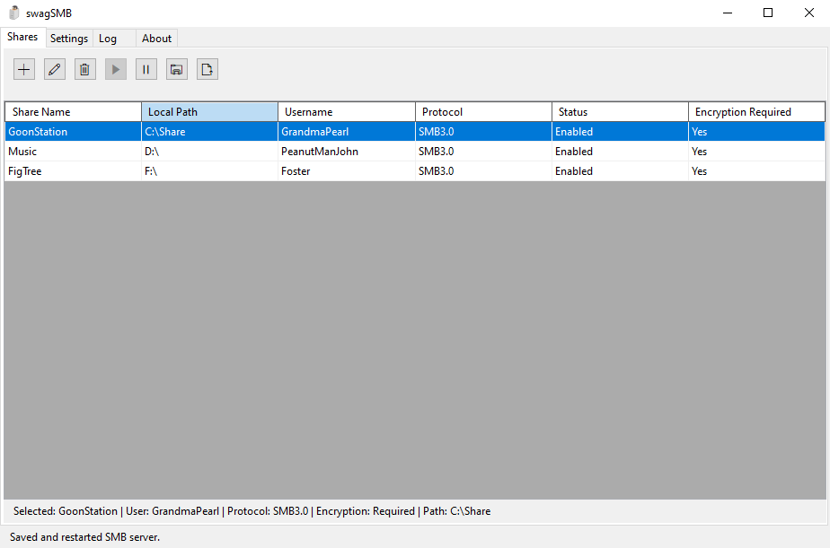
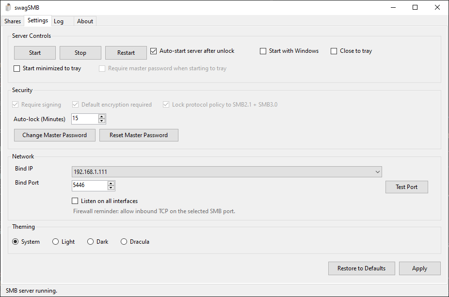
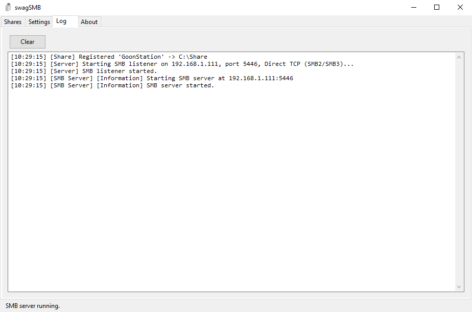
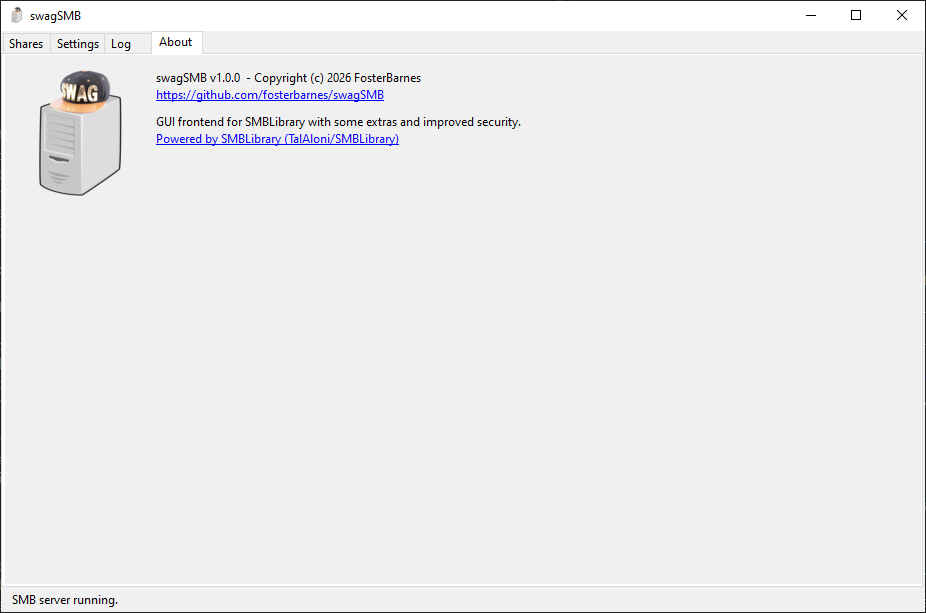
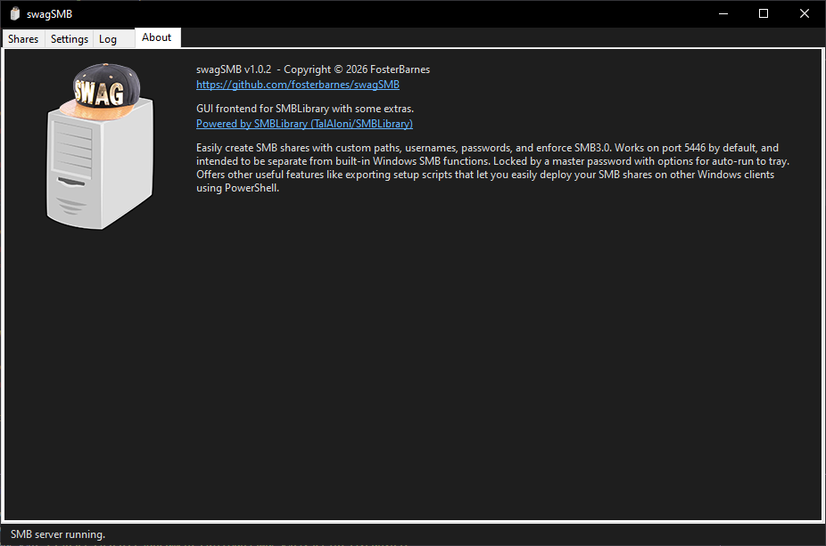
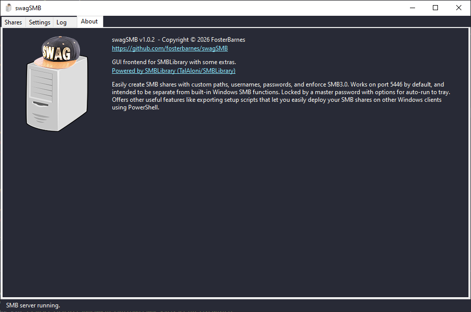

# swagSMB

GUI frontend for SMBLibrary with some extras. Windows only.

Easily create SMB shares with custom paths, usernames, passwords, and enforce SMB3.0. Works on port 5446 by default, and intended to be separate from built-in Windows SMB functions. Locked by a master password with options for auto-run to tray. Offers other useful features like exporting setup scripts that let you easily deploy your SMB shares on other Windows clients using PowerShell. 


<!-- Quick Reference --
version = 1.0.3

x64Installer = https://github.com/fosterbarnes/swagSMB/releases/download/v1.0.3/swagSMBInstaller_v1.0.3_x64.exe

x86Installer = https://github.com/fosterbarnes/swagSMB/releases/download/v1.0.3/swagSMBInstaller_v1.0.3_x86.exe

ARM64Installer = https://github.com/fosterbarnes/swagSMB/releases/download/v1.0.3/swagSMBInstaller_v1.0.3_arm64.exe

x64Portable = https://github.com/fosterbarnes/swagSMB/releases/download/v1.0.3/swagSMBPortable_v1.0.3_x64.zip

x86Portable = https://github.com/fosterbarnes/swagSMB/releases/download/v1.0.3/swagSMBPortable_v1.0.3_x86.zip

ARM64Portable = https://github.com/fosterbarnes/swagSMB/releases/download/v1.0.3/swagSMBPortable_v1.0.3_arm64.zip
-->

## 


## Downloads

<table border="0">
<tbody>
<tr>
<td align="center" valign="top"><a href="https://github.com/fosterbarnes/swagSMB/releases/download/v1.0.3/swagSMBInstaller_v1.0.3_x64.exe"></a></td>
<td align="center" valign="top"><a href="https://github.com/fosterbarnes/swagSMB/releases/download/v1.0.3/swagSMBInstaller_v1.0.3_x86.exe"></a></td>
<td align="center" valign="top"><a href="https://github.com/fosterbarnes/swagSMB/releases/download/v1.0.3/swagSMBInstaller_v1.0.3_arm64.exe"></a></td>
</tr>
</tbody>
</table>

<table border="0">
<tbody>
<tr>
<td align="center" valign="top"><a href="https://github.com/fosterbarnes/swagSMB/releases/download/v1.0.3/swagSMBPortable_v1.0.3_x64.zip"></a></td>
<td align="center" valign="top"><a href="https://github.com/fosterbarnes/swagSMB/releases/download/v1.0.3/swagSMBPortable_v1.0.3_x86.zip"></a></td>
<td align="center" valign="top"><a href="https://github.com/fosterbarnes/swagSMB/releases/download/v1.0.3/swagSMBPortable_v1.0.3_arm64.zip"></a></td>
</tr>
</tbody>
</table>

## Screenshots

### Tabs

| <h3>Shares</h3> |
|:---:|
|  |

| <h3>Settings</h3> |
|:---:|
|  |

| <h3>Logs</h3> |
|:---:|
|  |


### Theming

| <h3>Light</h3> |
|:---:|
|  |

| <h3>Dark</h3> |
|:---:|
|  |

| <h3>Dracula</h3> |
|:---:|
|  |

## Compatibility

| Platform  | Architecture   |
|------------|-----------------|
| Windows 10 | x86, x64, arm64 |
| Windows 11 | x86, x64, arm64 |

## Planned Ports

| Platform  | Architecture   |
|------------|-----------------|
| Debian Linux | x64, arm64 |
| macOS | x64, arm64 |

## Security

### What the app enforces

- Encrypted local vault (`%AppData%\swagSMB\config.secure`):
  - PBKDF2-SHA256 key derivation from the master password (600,000 iterations)
  - AES-CBC encryption with random per-file salt and IV
  - HMAC-SHA256 integrity over header + ciphertext (verified before decryption)
- Master password required to open the GUI (and to start the server, unless auto-tray is consented to).
- NTLMv2-only authentication: NTLMv1 and NTLMv1-Extended Session Security are rejected at the auth layer.
- Cryptographically random NTLM server challenge (`RandomNumberGenerator`), not predictable.
- SMB1 is hard-disabled in code; SMB2 and SMB3 only.
- Local share `LocalPath` validation: must be a fully-qualified path on a fixed local disk; UNC paths and reparse points/junctions are rejected.
- Master-password retries throttled in-app (1.5s delay per failure, app exits after 5 consecutive failures).
- Two enabled shares with the same username but different passwords are rejected at startup (prevents auth-conflict bypass).

### What the app does NOT enforce (upstream SMBLibrary 1.5.7 limitations)

- `Require signing`, `Default encryption required`, and `Lock protocol policy` toggles are present in Settings for forward-compatibility but are currently **disabled** in the UI. SMBLibrary 1.5.7's `SMBServer.Start(...)` does not gate connections on signing/encryption negotiation; clients negotiate independently. **Treat the wire as untrusted on hostile networks.**
- If wire-level encryption and integrity are non-negotiable requirements, restrict swagSMB to trusted network segments or protect it with a tunnel (WireGuard, Tailscale, etc.) until native support is available upstream.

### Auto-tray credential storage (opt-in)

- If you enable **Start minimized to tray** and turn **off** *Require master password when starting to tray*, swagSMB stores a DPAPI-protected blob (`tray.key`) under your Windows user. Any program running as your Windows user can decrypt this blob and recover the master password. A consent dialog is shown before this is enabled. Leave the require-password option on for stronger protection.

### Notes

- Default listen port is **5446** (avoids conflicting with Windows SMB on **445**). Change it in Settings if needed and allow the port through the firewall.
- Exported PowerShell mapping scripts contain the share password (Base64-encoded UTF-8 string, **not encrypted**). The export dialog warns you and asks you to delete the script after first run. A "prompt for credentials at runtime" mode is also available.

## Building/Compiling from Source

### Requirements

- Windows 10/11
- winget

winget comes with most Windows installations, but if you happen to be on Windows 10 LTSC IoT, you'll need to install it. 

Run the following in Windows PowerShell as Administrator to install winget (skip this step if you are not running Windows 10 LTSC IoT):


```
$ProgressPreference = 'SilentlyContinue'
iwr https://github.com/microsoft/microsoft-ui-xaml/releases/download/v2.8.6/Microsoft.UI.Xaml.2.8.x64.appx -OutFile ~/Downloads/Microsoft.UI.Xaml.2.8.x64.appx
iwr https://aka.ms/Microsoft.VCLibs.x64.14.00.Desktop.appx -OutFile ~/Downloads/Microsoft.VCLibs.x64.14.00.Desktop.appx
iwr https://github.com/microsoft/winget-cli/releases/download/v1.8.1911/76fba573f02545629706ab99170237bc_License1.xml -OutFile ~/Downloads/76fba573f02545629706ab99170237bc_License1.xml
iwr https://github.com/microsoft/winget-cli/releases/download/v1.8.1911/Microsoft.DesktopAppInstaller_8wekyb3d8bbwe.msixbundle -OutFile ~/Downloads/Microsoft.DesktopAppInstaller_8wekyb3d8bbwe.msixbundle

Add-AppxPackage ~/Downloads/Microsoft.UI.Xaml.2.8.x64.appx
Add-AppxPackage ~/Downloads/Microsoft.VCLibs.x64.14.00.Desktop.appx

$loc = (Resolve-Path ~/Downloads).Path
$install = "$loc\Microsoft.DesktopAppInstaller_8wekyb3d8bbwe.msixbundle"
$lic = "$loc\76fba573f02545629706ab99170237bc_License1.xml"

# Check if files exist
if (-Not (Test-Path $install)) {
    throw "Package file not found: $install"
}
if (-Not (Test-Path $lic)) {
    throw "License file not found: $lic"
}

# Run the command with expanded arguments
Start-Process powershell -ArgumentList "-NoProfile -Command Add-AppxProvisionedPackage -Online -PackagePath `"$install`" -LicensePath `"$lic`" -Verbose; Read-Host 'Press Enter to exit'" -Verb RunAs

# Remove Microsoft Store from package source
Start-Process powershell -Verb RunAs -ArgumentList '-NoProfile -Command "winget source remove msstore; winget source update"'

```

Credit: [github.com/technoscavenger](https://gist.github.com/technoscavenger/37f06e23daa833d0c7bee1d378ff332e#file-installwinget-ps1)

### Install PowerShell 7

```
winget install Microsoft.PowerShell

```

Restart your computer. PowerShell may not show up in start menu correctly otherwise.


### Install Build Dependencies


Open PowerShell 7 as Administrator and run the following. Keep this window open:

```
winget install Microsoft.DotNet.SDK.8
winget install Git.Git
winget install GitHub.cli
winget install JRSoftware.InnoSetup

```

Add Inno Setup to System PATH

```
[Environment]::SetEnvironmentVariable('Path', [Environment]::GetEnvironmentVariable('Path', 'Machine').TrimEnd(';') + ';' + (Join-Path $env:LOCALAPPDATA 'Programs\Inno Setup 6'), 'Machine')

```

Close PowerShell before starting the next step. A full app refresh is required.

References: [.NET 8 SDK](https://dotnet.microsoft.com/en-us/download/visual-studio-sdks), [Git](https://git-scm.com/), [GitHub CLI](https://git-scm.com/tools/command-line), [InnoSetup 6](https://jrsoftware.org/isinfo.php)

### Clone Repo & Build

Open PowerShell 7 as Admin and point to your desired project directory.

Example: `cd C:\Users\Foster\Documents`

Clone this repo:

```
git clone --recursive https://github.com/fosterbarnes/swagSMB && cd swagSMB

```


Do a build test

```
.\.scripts\.buildAll.ps1

```


Do a run test

```
.\.scripts\.run.ps1

```

Assuming everything went as planned, the app should be running! Check out the rest of the included scripts for semi-automatic github repo management.